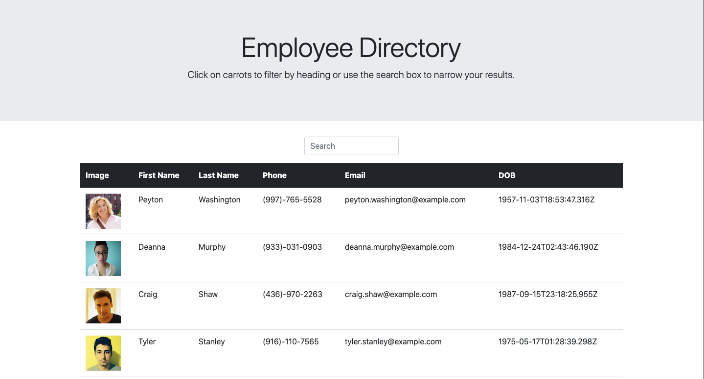

# Employee Directory



## Description

The Employee Directory is a React.js application that divides the UI into components, manage component state, and respond to user events. The application utilizes the Random User Generator API to mock an employee directory consisting of 100 employees.

Given the table of random users, when the user loads the page, a table of employees should render.

The user is able to:

  * Search the table for user by name

  * Filter the users by first or last name property

View the deployed app [here](https://jacquelineadean.github.io/EmployeeDirectory/)

## User Story
```
 As a user, 
 I want to be able to view my entire employee directory at once 
 So that I have quick access to their information.
```
## Business Context

An employee or manager would benefit greatly from being able to view non-sensitive data about other employees. It would be particularly helpful to be able to filter employees by name.

# Table of Contents
[Installation](#installation)

[Usage](#usage)

[Questions](#questions)

# Installation

** Once the repository has been forked and cloned, the user will need to change directories into the repository and run the command "npm install" in order to retrieve the neccessary dependencies. 

# Usage
** Once the application has been installed, the user will run "npm start" in the command line to initialize the server.

** In the server, the user can interact with the application to view the Employee Directory.


# Questions
For any questions, please connect with me:

Github username: @Jacquelineadean

Github URL: [GitHub](https://github.com/jacquelineadean/)

LinkedIn: [LinkedIn](https://www.linkedin.com/in/jacqueline-dean-968a66150/)

Email: Jacquelineadean@gmail.com
